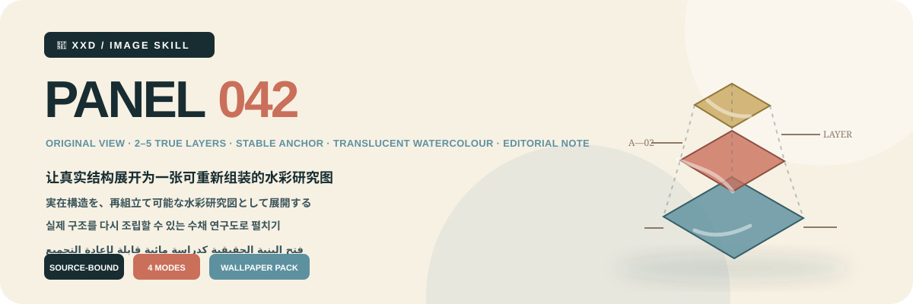
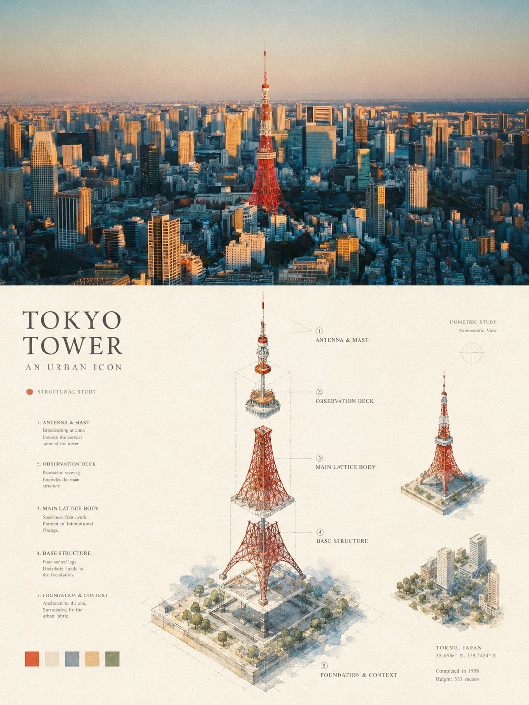
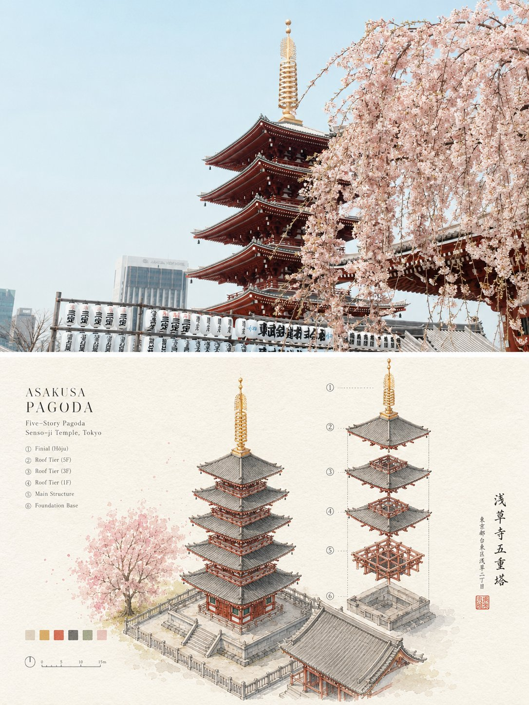
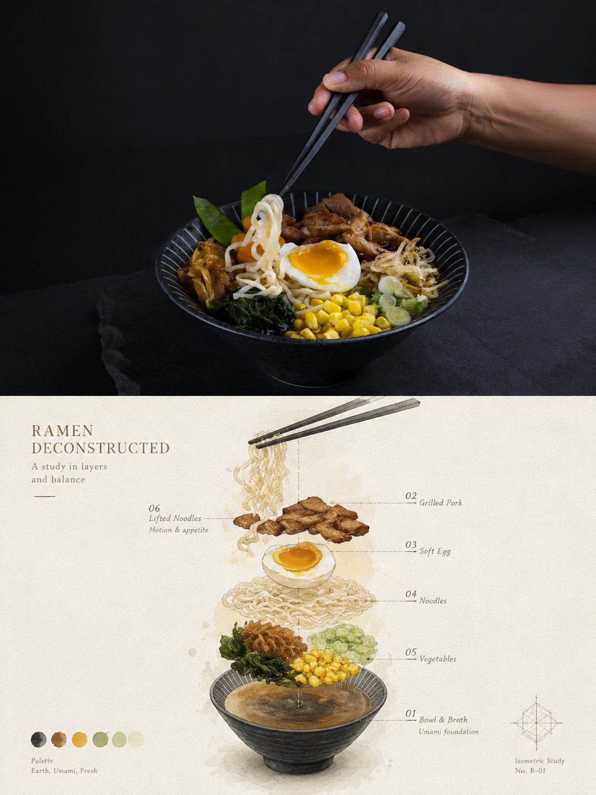

<p align="center"></p>

<div align="center">

# 🦁 XXD Panel 042

### 让真实结构展开为一张可重新组装的水彩研究图

[](./SKILL.md)
[](#)
[](#)

<strong>简体中文</strong> · <a href="README.en.md">English</a> · <a href="README.ja.md">日本語</a> · <a href="README.ko.md">한국어</a> · <a href="README.ar.md">العربية</a>

</div>

<div>

> 原始视角 · 二至五层 · 稳定锚点 · 透明水彩 · 编辑注释

原始视角与真实结构是唯一依据。二至五个有意义的完整层级沿真实轴线围绕一个稳定锚点展开，保留足够身份，让观众能在脑中重新组装主体。

## 为什么需要这套 Skill

这套风格依赖每一张源图，不是可替换内容的装饰预设。它遵循这条重构链：

```text
审计原始视角与结构 → 锁定三至七个决定性特征和四至六种主色 → 找到一个稳定完整基座或锚点 → 只沿真实轴线分离二至五个有意义完整层级 → 保持共同中心与适中间距 → 在象牙白纸上以清晰线稿加透明水彩呈现 → 加入克制结构注释
```

如果换成无关照片后，辨识度、构造、位置、材质、颜色、留白与文案都不发生实质变化，结果就不属于这套 Panel。

## 视觉契约

- 原图是唯一依据；保留身份、整体轮廓、比例、原始观察方向、对称／非对称、关键构件关系、决定性细节、材质色与尺度线索。
- 只沿真实轴线分离二至五个有意义的完整层级或构件，间距均匀适中，并保留一个稳定、细节最丰富的基座或锚点，使观众可在脑中重新组装。
- 建筑器物可按屋顶、楼层、壳体、框架、基座、模块或连接体分层；空间按景深展开；人物、动物、植物保持身体完整，禁止肢解或机械化。
- 使用温暖象牙白水彩纸、清晰克制线稿、透明水彩、纸纹、细致笔触、少量结构辅助线和干净源图色。
- 保持专业编辑克制与充足留白，避免戏剧爆炸、无依据碎片、科技UI或工程说明书密度。

完整审美约束与拒绝项写在 Skill 和生产提示词中；它们保留原始提示词的审美动机，但不会把历史 3:4 画布变成隐藏默认值。 [SKILL.md](SKILL.md) · [production prompt](references/xxd-panel-042-prompt.en.md)

## 样张 · 来自 X

> [小小东（@xiaoxiaodong01）](https://x.com/xiaoxiaodong01/status/2091032515318521971) · 2026 年 8 月 22 日<br>
> GPT2 × 拆解 × 分层 × 美学提示词 × VOL.042

<table>
  <tr>
    <td width="50%"><a href="https://x.com/xiaoxiaodong01/status/2091032515318521971"></a></td>
    <td width="50%"><a href="https://x.com/xiaoxiaodong01/status/2091032515318521971"></a></td>
  </tr>
  <tr>
    <td width="50%"><a href="https://x.com/xiaoxiaodong01/status/2091032515318521971"></a></td>
    <td width="50%"><a href="https://x.com/xiaoxiaodong01/status/2091032515318521971"></a></td>
  </tr>
</table>

<p align="center"><a href="https://x.com/xiaoxiaodong01/status/2091032515318521971">查看原推文与完整提示词 →</a></p>

这些样张用于展示 042 的美学动机，不会把样张中的主体、构图、配色、文案或旧画幅变成生成参考或当前默认值。

## 四种可组合输出模式

可以用 `1`、`1+3`、`1、2、4` 或 `全部` 选择一个或多个模式；`全部` 每张源图输出 7 张 PNG：三种普通模式各一张，外加四张壁纸。

| 模式 | 未指定尺寸 | 成果物 |
| --- | --- | --- |
| `top-bottom` | 源图自适应 `W×2H` | 上方完整源图＋下方变化设计，严格 50/50 |
| `left-right` | 源图自适应 `2W×H` | 左侧完整源图＋右侧变化设计，严格 50/50 |
| `design-only` | 源图自适应 `W×H` | 只显示变化设计，不出现原照片 |
| `wallpaper-pack` | 设备分别标注尺寸 | 手机、iPad、电脑、儿童手表四张独立 PNG |

壁纸可选连贯或独立。连贯套装先批准一张定调图，所有设备都共同参考原图与这同一锚点，绝不裁切或串联衍生图；独立套装每张只参考原图。

## 文案与语言

正式生成前确认自动文案、准确自定义文案或无文字；语言跟随目标受众而不是命令语言，用户给出的准确文案逐字保留。

本项目的文案规则： 使用一个简短身份、主题、动作、状态或象征标题，只配有依据的结构标记、材料词、状态词或微注释；编号仅在用户提供或可靠确认时使用。目标语言文字沿真实轴线、分层方向、留白边缘或标注点排列。

## 几何、位图与可信边界

普通模式未指定尺寸时按源图自适应；双联严格 50/50，全部交付为 PNG 位图。每次调用都在 `~/Desktop/xxd/` 下创建新任务，绝不泄露私密生成路线信息。

已配置的位图桥只输出脱敏状态，绝不暴露服务方、端点、凭据、请求头、提示词、响应或账户信息。SVG、HTML、Canvas、图表和程序绘图都不能代替最终位图作品。

## 开始使用

```bash
git clone https://github.com/nevertoday/xxd-panel-042.git
mkdir -p ~/.codex/skills
ln -s "$(pwd)/xxd-panel-042" ~/.codex/skills/xxd-panel-042
```

Claude Code 用户可把同一文件夹链接到 `~/.claude/skills/xxd-panel-042`. 安装后请重启 Agent 会话。

```text
$xxd-panel-042
Use this photograph, ask me for the modes and copy setting, then generate fresh raster outputs.
```

完整规格: [Skill 工作流](SKILL.md) · [原始风格档案](references/042-source.md) · [英文生产提示词](references/xxd-panel-042-prompt.en.md) · [中文生产提示词](references/xxd-panel-042-prompt.zh-CN.md)

## 关于 XXD

XXD 是小小东品牌名的缩写，本项目由小小东创建并维护： [@xiaoxiaodong01](https://x.com/xiaoxiaodong01).

## 支持与会员

### 深度咨询 · 299 元／小时

一对一深入咨询 Skills 的使用与工作流，通过微信联系小小东预约。 [WeChat](https://xiaoxiaodong.pages.dev/assets/wechat-qr.png)

### 小小东 Skills 用户交流群 · 99 元

一次付费加入 Skills 用户交流群，用于工作流分享和用户间讨论；不包含按小时计费的一对一咨询。

### 知识星球＋成员提示词库 · 699 元／年

知识星球和成员提示词库是一份会员费用：从任一入口开通后，通过微信联系小小东获取另一边的权益。

[Knowledge Planet](https://wx.zsxq.com/group/15554814142882) · [Member Prompt Library](https://vip.xiaoxiaodong.ai/)

<p align="center"><a href="https://xiaoxiaodong.pages.dev/assets/wechat-qr.png"></a></p>

<div align="center"><strong>解构是看见它如何成立，而不是展示它如何破碎。</strong></div>

---

<div align="center">

## ☕ 支持这个开源项目

算力赞助请使用小小东自己的微信或支付宝赞赏码；赞助完全自愿，不改变开源项目的访问权限。


<table><tr>
<td align="center"><a href="https://colors.xiaoxiaodong.ai/docs/images/wechat-reward-qr.png"></a><br><strong>WeChat</strong></td>
<td align="center"><a href="https://colors.xiaoxiaodong.ai/docs/images/alipay-reward-qr.png"></a><br><strong>Alipay</strong></td>
</tr></table>

</div>
</div>
